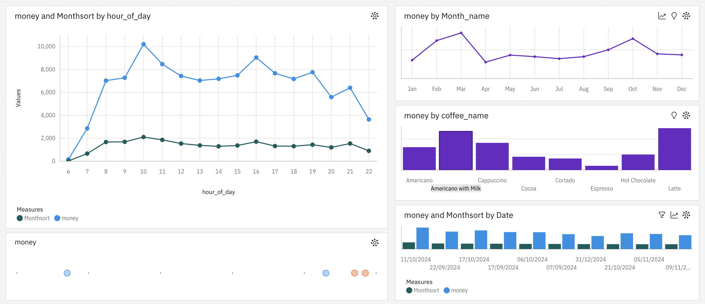

# Business Sales Dashboard (IBM Cognos)

## 📊 Overview
This project features an interactive dashboard built using **IBM Cognos Analytics** to analyze **business sales data** across time, weekdays, and product categories (e.g., different coffee types).  

The dashboard helps identify sales patterns, peak business hours, and product-wise performance to support **data-driven decision making**.

---

## 🔑 Key Insights
- Sales distribution by **hour of the day** and **day of the week**.  
- Monthly revenue trends and seasonal comparisons.  
- Product-level analysis (e.g., Americano, Latte, Cappuccino, etc.).  
- Combined filters for **time + product** insights.  

---

## 🚀 Features
- Interactive charts and filters.  
- Real-time visualization of sales trends.  
- Easy identification of top-performing products and time slots.  
- Custom views for managers and business analysts.  

---

## 🛠️ Tools & Technology
- **IBM Cognos Analytics** for dashboarding and visualization.  
- **Business sales dataset** (sample coffee shop transactions).  

---

## 📌 Usage
1. Open the dashboard in **IBM Cognos Analytics**.  
2. Use filters (hour, month, product) to drill down into the data.  
3. Export insights for reporting and decision-making.  

---

## 📷 Dashboard Preview

